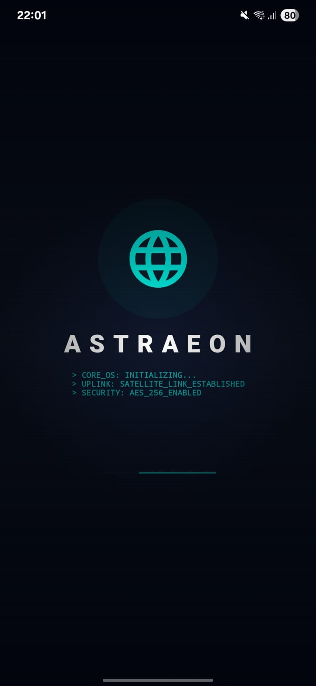
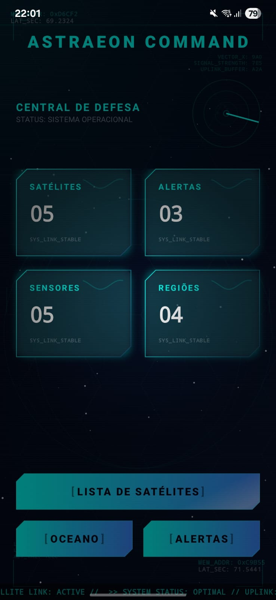
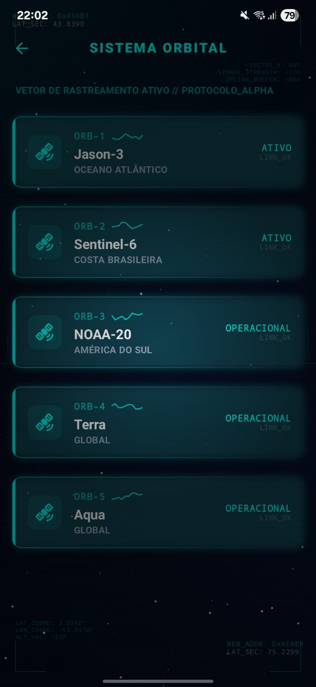
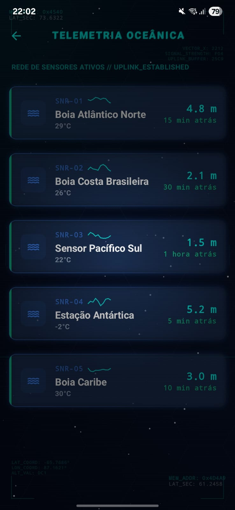
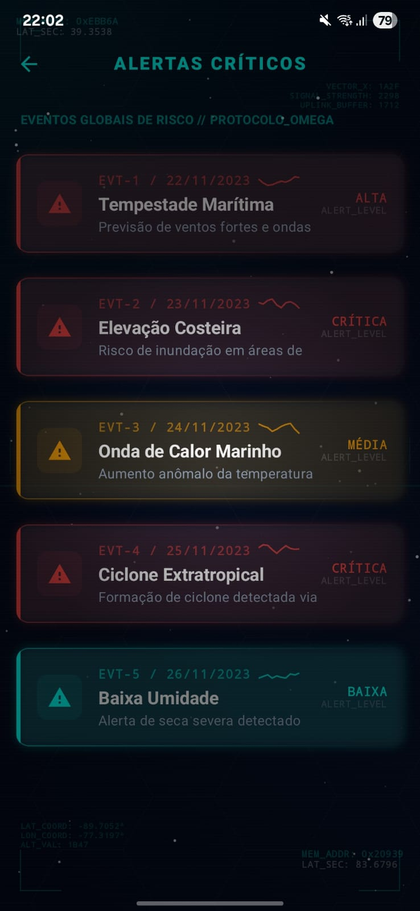
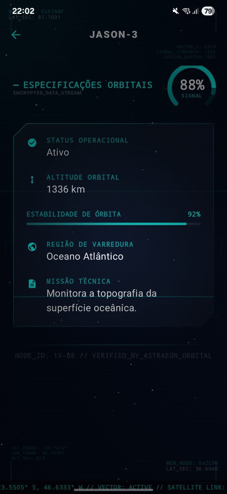

# ASTRAEON - Sistema Inteligente de Defesa Climática Orbital 🛰️


O **ASTRAEON** é uma plataforma de monitoramento climático de última geração baseada em tecnologia espacial. O sistema integra telemetria de satélites, sensores oceânicos e alertas globais em uma interface tática imersiva (HUD), projetada para auxiliar na prevenção de desastres naturais através de inteligência espacial.

---

## 🛠️ Stack Tecnológica

- **Linguagem:** Kotlin
- **UI:** Jetpack Compose (Material 3)
- **Navegação:** Navigation Compose com animações de transição
- **Gerenciamento de Estado:** StateFlow & ViewModel
- **Padrão de Arquitetura:** MVVM (Model-View-ViewModel) + Repository Pattern
- **Efeitos Visuais:** Canvas API, Glassmorphism, Neon Glow e Animações de Partículas

---

## 🏛️ Arquitetura do Projeto

O projeto segue os princípios da **Clean Architecture** adaptados para um ambiente reativo, garantindo separação de responsabilidades e facilidade de manutenção.

### Camadas da Aplicação:
1.  **Data:** Contém os modelos de dados puro e as listas mockadas que servem como "Fonte Única de Verdade".
2.  **Repository:** Atua como mediador entre a fonte de dados e os ViewModels, abstraindo a lógica de recuperação de dados.
3.  **ViewModel:** Gerencia o estado da UI de forma reativa, expondo `StateFlow` para o Compose.
4.  **UI (Compose):** Camada de apresentação dividida em `Screens` (telas completas), `Components` (átomos reutilizáveis) e `Navigation` (gerenciamento de rotas).

---

## 🗺️ Fluxo de Navegação e Telas

A navegação foi projetada para simular a operação de um cockpit de comando orbital.

### 1. Boot Sequence (Splash Screen)
Simula a inicialização do hardware Astraeon com logs de sistema e efeito Glitch.



### 2. Strategic Dashboard (Home)
Painel central com radar pulsante, globo holográfico e cards de resumo.



### 3. Constelação Orbital (Satellites)
Lista de satélites com telemetria em tempo real (Sparklines) e status de link.



### 4. Monitoramento Oceânico (Ocean)
Rede de sensores de profundidade e temperatura marinha.



### 5. Central de Alertas (Alerts)
Relatórios de eventos meteorológicos extremos detectados.



### 6. Relatório Técnico (Details)
Análise profunda de cada item com Gauge de sinal, Scanner laser e efeito de digitação de dados (Typewriter).



---

## 🎨 Design System: Tactical HUD

O ASTRAEON utiliza uma estética **Sci-Fi Tactical HUD**, focada em imersão:
- **Tactical Background:** Grade hexagonal dinâmica, nebulas profundas e estrelas animadas.
- **Glassmorphism:** Cartões semi-transparentes com bordas brilhantes neon.
- **HUDFrame:** Dados técnicos (coordenadas, hashes e endereços de memória) que mudam em tempo real nos cantos da tela.
- **Micro-interações:** Todos os botões e cards possuem feedback visual de escala e brilho ao serem acionados.

---

## 📁 Estrutura de Pastas

```text
astraeon/
├── data/
│   ├── model/         # Entidades de dados
│   ├── repository/    # Repositórios (Abstração de dados)
│   └── mock/          # Listas estáticas locais
├── ui/
│   ├── components/    # Componentes HUD reutilizáveis
│   ├── navigation/    # Grafo de navegação e rotas
│   ├── screens/       # Telas completas da aplicação
│   └── theme/         # Definições de cores neon e tipografia
├── viewmodel/         # Lógica de estado e negócios
└── MainActivity.kt    # Ponto de entrada com Post-Processing
```

---

## 🚀 Como Executar

1. Clone o repositório.
2. Abra no **Android Studio**.
3. Certifique-se de estar usando o **JDK 17**.
4. Sincronize o Gradle.
5. Execute em um emulador ou dispositivo físico (API 24+).

---

**Desenvolvido para o Global Solution - FIAP**  
"Protegendo a Terra através da inteligência espacial."
